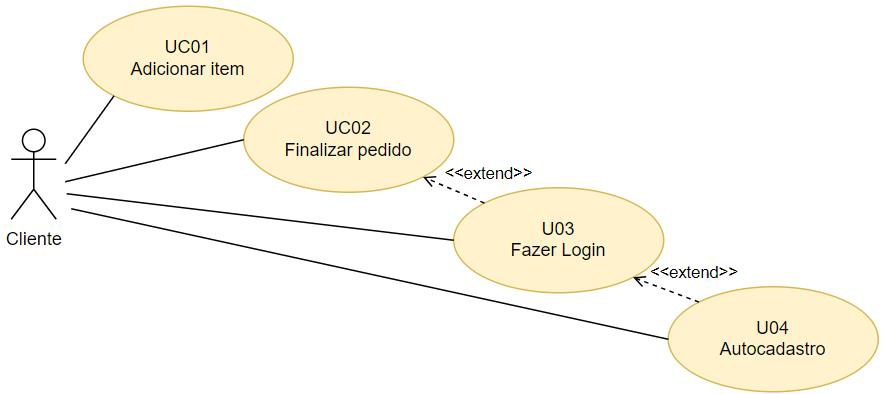
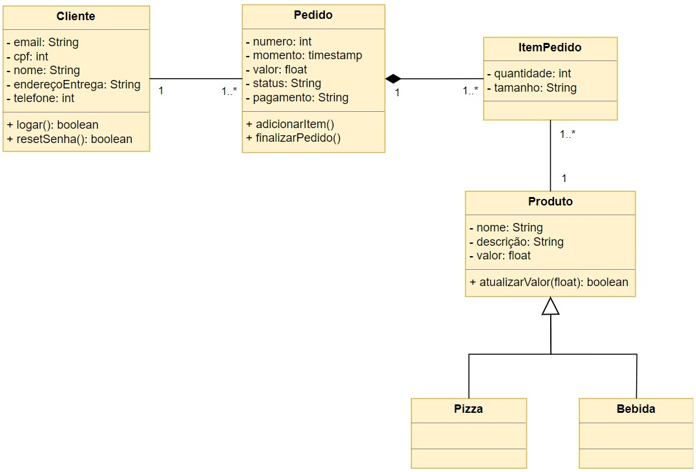

<h1 align="center"> CiberPizza 🍕 </h1>

<p align="center">
    <a href="#descrição-do-projeto-">Descrição do Projeto</a> •
    <a href="#objetivos-">Objetivos</a> •
    <a href="#integrantes-do-grupo-">Integrantes do Grupo</a> •
    <a href="#casos-de-uso-">Casos de Uso</a> •
    <a href="#especificações-dos-casos-de-uso">Especificações dos Casos de Uso</a> •
    <a href="#diagrama-de-classes-">Diagrama de Classes</a> •
    <a href="#tecnologias-utilizadas-">Tecnologias Utilizadas</a> •
    <a href="#licença-">Licença</a>
</p>

## Descrição do Projeto 📄

Olá! Este é um projeto acadêmico que desenvolvemos como parte da disciplina de Aplicação Programação Orientada a Objetos (APOO) no 4º semestre do curso de Ciência da Computação na Universidade Paulista (UNIP). O projeto, que carinhosamente chamamos de "CiberPizza," é uma aplicação web que criamos com Java, usando o framework Spring Boot e integração com um banco de dados.

## Objetivos 🚀

Nossa principal missão neste projeto é aplicar os conceitos de programação orientada a objetos, desenvolvimento de aplicações web e integração com banco de dados. Queremos ganhar experiência prática na construção de sistemas complexos e aprimorar nossa habilidade em modelagem de classes. Vamos juntos nessa jornada de aprendizado!

## Integrantes do Grupo 👥

- [Rafael Ferreira Machado](https://www.linkedin.com/in/rafaelmachadobr/)
- [Kayky Vasconcelos](https://www.linkedin.com/in/kayky-vasconcelos-a99b10287/)
- [Victor Gomes](https://www.linkedin.com/in/victor-gomes23/)
- [Milene Neto](https://www.linkedin.com/in/milene-neto-276390231/)

## Casos de Uso 📋



## Especificações dos Casos de Uso

### Caso de Uso UC01 – Adicionar item

| **Ator Principal** | **Ator Secundário** | **Descrição**                                                                                | **Pré-condições**                                                        | **Pós-condições**                         |
| ------------------ | ------------------- | -------------------------------------------------------------------------------------------- | ------------------------------------------------------------------------ | ----------------------------------------- |
| Cliente            | Nenhum              | Este caso de uso descreve os passos necessários para que o cliente adicione itens ao pedido. | O cliente acessou o site e selecionou a opção para criar um novo pedido. | A pizza ou bebida é adicionada ao pedido. |

**Cenário Principal:**

| **Ação do Ator**                                                       | **Ação do Sistema**                                                |
| ---------------------------------------------------------------------- | ------------------------------------------------------------------ |
| O cliente acessa o site e seleciona a opção para criar um novo pedido. |                                                                    |
|                                                                        | O sistema exibe as pizzas 🍕 e bebidas 🥤 disponíveis no cardápio. |
| O cliente seleciona uma pizza.                                         |                                                                    |
|                                                                        | O sistema exibe os tamanhos de pizza disponíveis.                  |
| O cliente seleciona o tamanho.                                         |                                                                    |
| O cliente escolhe a quantidade da pizza escolhida.                     |                                                                    |
|                                                                        | O sistema calcula o valor 💰 e exibe.                              |
| O cliente revisa a pizza e clica no botão "Incluir no Pedido".         |                                                                    |
|                                                                        | O sistema inclui a pizza no pedido.                                |

**Restrições / Validações:**

| **Cenário Alternativo 3.1 – O cliente selecionou uma bebida**   |                                                    |
| --------------------------------------------------------------- | -------------------------------------------------- |
| **Ação do Ator**                                                | **Ação do Sistema**                                |
|                                                                 | O sistema exibe os tamanhos disponíveis da bebida. |
| O cliente seleciona a quantidade da bebida.                     |                                                    |
|                                                                 | O sistema calcula o valor e exibe.                 |
| O cliente revisa a bebida e clica no botão "Incluir no Pedido". |                                                    |
|                                                                 | O sistema inclui a bebida no pedido.               |

### Caso de Uso UC02 – Finalizar pedido

| **Ator Principal** | **Ator Secundário** | **Descrição**                                                                                   | **Pré-condições**                                                  | **Pós-condições**                 |
| ------------------ | ------------------- | ----------------------------------------------------------------------------------------------- | ------------------------------------------------------------------ | --------------------------------- |
| Cliente            | Nenhum              | Este caso de uso descreve os passos necessários para que o cliente finalize (conclua) o pedido. | O cliente deve estar logado. O pedido deve ter pelo menos um item. | O pedido é registrado no sistema. |

**Cenário Principal:**

| **Ação do Ator**                                                         | **Ação do Sistema**                                                                     |
| ------------------------------------------------------------------------ | --------------------------------------------------------------------------------------- |
| O cliente seleciona a opção para finalizar o pedido.                     |                                                                                         |
|                                                                          | O sistema exibe os detalhes do pedido.                                                  |
| O cliente revisa o pedido e seleciona a opção "Prosseguir".              |                                                                                         |
|                                                                          | O sistema consulta os dados do cliente, incluindo o endereço de entrega 🚚, e os exibe. |
| O cliente revisa o endereço de entrega e seleciona a opção "Prosseguir". |                                                                                         |
|                                                                          | O sistema exibe as formas de pagamento 💳.                                              |
| O cliente escolhe a forma de pagamento e seleciona a opção "Finalizar".  |                                                                                         |
|                                                                          | O sistema registra o pedido.                                                            |

**Restrições / Validações:**

| **Cenário Alternativo 3.1 – O cliente selecionou a opção cancelar pedido** |                                                                         |
| -------------------------------------------------------------------------- | ----------------------------------------------------------------------- |
| **Ação do Ator**                                                           | **Ação do Sistema**                                                     |
|                                                                            | O sistema exibe uma mensagem solicitando a confirmação do cancelamento. |
| O cliente confirma o cancelamento.                                         |                                                                         |
|                                                                            | O sistema remove os itens e cancela o pedido.                           |

| **Cenário Alternativo 4.1 – O sistema verifica que o cliente não está logado** |                                                |
| ------------------------------------------------------------------------------ | ---------------------------------------------- |
| **Ação do Ator**                                                               | **Ação do Sistema**                            |
|                                                                                | O sistema executa o caso de uso "Fazer Login." |

| **Cenário Alternativo 5.1 – O cliente solicita a alteração do endereço de entrega** |                                                                       |
| ----------------------------------------------------------------------------------- | --------------------------------------------------------------------- |
| **Ação do Ator**                                                                    | **Ação do Sistema**                                                   |
|                                                                                     | O sistema exibe um campo para a inclusão do novo endereço de entrega. |
| O cliente informa o novo endereço e confirma.                                       |                                                                       |
|                                                                                     | O sistema atualiza o endereço de entrega.                             |

| **Cenário Exceção 1 – O pedido está vazio** |                                                                                                                            |
| ------------------------------------------- | -------------------------------------------------------------------------------------------------------------------------- |
| **Ação do Ator**                            | **Ação do Sistema**                                                                                                        |
|                                             | O sistema informa que o pedido está vazio e disponibiliza a opção do cardápio para que o cliente adicione itens ao pedido. |

## Diagrama de Classes 🧩



## Tecnologias Utilizadas 💻

- Java ☕
- Spring Boot 🚀
- Banco de dados 🎲:
  - H2 Database 🏦 (para testes e desenvolvimento)
  - MySQL 🗃️ (para produção)
- Thymeleaf 🌐 (para desenvolvimento da interface web)
- Project Lombok 🔧 (para redução de boilerplate)
- Deploy:
  - Railway 🚂 (para testes e desenvolvimento)

## Configuração e Execução 🛠️

Para executar o projeto localmente, siga os passos a seguir:

**1. Clone este repositório.**

- Abra seu terminal e execute o seguinte comando para clonar o repositório do projeto:

```bash
git clone https://github.com/rafaelmachadobr/CiberPizza
```

**2. Configuração do Ambiente**

- Instale o [Java 17](https://www.oracle.com/java/technologies/downloads/#java17) ou superior.
- Instale o [MySQL](https://dev.mysql.com/downloads/installer/) ou use o [H2 Database](https://www.h2database.com/html/main.html) para testes e desenvolvimento.
- Instale o [Maven](https://maven.apache.org/download.cgi) ou use o [Maven Wrapper](https://maven.apache.org/wrapper/) para testes e desenvolvimento.

**3. Importe o Projeto na sua IDE Java**

- Abra sua IDE Java de preferência (por exemplo, Eclipse, IntelliJ IDEA, Visual Studio Code com extensão Java).
- Importe o projeto que você clonou.

**4. Execute a Aplicação Spring Boot**

- Dentro da sua IDE, localize a classe principal do projeto (geralmente chamada de `CiberPizzaApplication`) e execute-a. Isso iniciará a aplicação Spring Boot.

## Licença 📜

Este projeto está disponível sob a Licença MIT. Consulte o arquivo [LICENSE](LICENSE) para obter mais detalhes.
